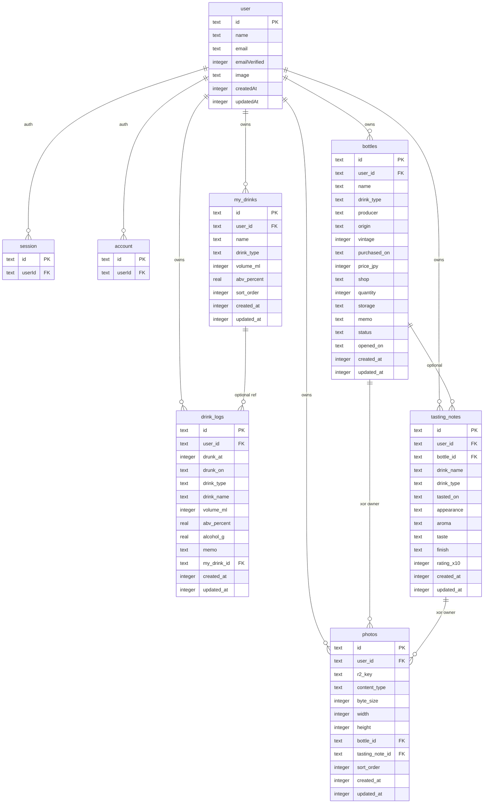

# データモデル（ER / Drizzle スキーマ設計）

Phase 1-04 の成果物。Phase 2-01（Drizzle 実装・マイグレーション）の正本。

- 状態: **承認済み**（main マージ）
- ソース: [spec/01-requirements.md](01-requirements.md)、[roadmap/phase-01-design/04-er-drizzle-schema.md](../roadmap/phase-01-design/04-er-drizzle-schema.md)
- 実装ルール: [`.cursor/rules/database.mdc`](../.cursor/rules/database.mdc)

計算式・グラスプリセットの数値は [01-requirements.md](01-requirements.md) 1.2 を正とする。丸め・入力上限の確定は 1-06（`spec/features/alcohol-calculation.md`）に委譲する。

---

## 1. 決定事項

1-04 の「要確認」を、要件と後続タスクから落として確定する。異議があれば本 PR のレビューで指摘する。

| 項目 | 決定 | 根拠 |
|---|---|---|
| アプリ用 `users` テーブル | **作らない**。Better Auth の `user` を唯一のユーザー正本にする | 二重管理を避ける（1-04 / 2-01 のリスク指摘） |
| Auth テーブル名 | ライブラリ既定（`user` / `session` / `account` / `verification`）に従う。**名前は凍結しない** | CLI 生成物を正とする |
| アプリ主キー | **UUID v4**（`crypto.randomUUID()`）、型は `text` | Workers で利用可能。推測耐性 |
| 日時（瞬間） | **INTEGER（Unix ミリ秒、UTC）** | 範囲検索が容易。表示・集計は Asia/Tokyo |
| 日付のみ | **TEXT `YYYY-MM-DD`（Asia/Tokyo のカレンダー日）** | 購入日・飲んだ日・開栓日。UTC 日付に変換しない |
| 日次集計キー | `drink_logs.drunk_on` をサーバーが `drunk_at` から算出して保存 | D1/SQLite の TZ 関数に頼らない |
| 純アルコール量 | **`alcohol_g` を保存**。クライアント値は信じず、サーバーが再計算 | サマリー負荷と改ざん防止。式の正は要件 1.2 / 1-06 |
| 記録メモ上限 | 500 文字 | モバイルの短メモ |
| マイドリンク名上限 | 40 文字 | 1 タップ表示 |
| 評価 | 整数 `rating_x10`（10〜50、5 刻み）。1.0〜5.0 の 0.5 刻み | float 比較を避ける |
| 写真の持ち方 | 単一 `photos` テーブル。`bottle_id` と `tasting_note_id` は排他。両方 NULL は未紐付け（先アップロード） | 4-04 / 5-03 の推奨フロー |
| ボトル写真 | スキーマは 1:N。MVP UI は 1 枚（`sort_order` 最小をサムネ） | 要件 1.3 は「写真」、ノート側が複数枚 |
| ボトル種類 | 飲酒記録と同じ 7 種 enum | フィルタ共通化（4-01 推奨） |
| ノートの銘柄 | **スナップショット必須**（`drink_name` / `drink_type`）+ 任意の `bottle_id` | ボトル改名後も当時の記録を残す |
| ボトル削除時のノート | **`bottle_id` を SET NULL**。ノートは残す | テイスティング履歴を消さない |
| 削除方針 | アプリエンティティは **物理削除** | 個人アプリ。監査用論理削除は不要 |
| 本数とステータス | **独立**。自動連動しない | 二重管理リスクはアプリ仕様（4-03）で扱う |
| 開栓日 | `opened_on`（日付、任意） | 4-03。無ければメモ運用になるのを避ける |
| `user_id` + `id` 複合 PK | **採用しない**。PK は `id`、アクセスは必ず `id AND user_id` | FK を単純に保つ。認可は API |

---

## 2. 原則

1. **アプリ所有テーブルはすべて `user_id` を持つ**。値はセッション由来のみ。クライアント入力のスキーマに `userId` を含めない。
2. **`user_id` の FK は Better Auth の `user.id` を参照**する。`ON DELETE CASCADE`。
3. **他ユーザー行を JOIN で混ぜない**。一覧・詳細・集計はすべて `user_id = session.userId` を最初の条件にする。
4. **更新・削除は「id の存在」ではなく「id + user_id の一致」**。不一致は存在しない場合と同じ 404（API。1-05）。
5. **Auth テーブルはアプリが直接書き換えない**。パスワード・セッション・アカウントは Better Auth API のみ。
6. **R2 キーはサーバー生成**。ユーザーのファイル名も `user_id` もキーに含めない。
7. **DB 列は snake_case、TypeScript プロパティは camelCase**。Drizzle でマッピングする。
8. **Zod を入力検証の正**とする。安定した enum / 排他条件のみ DB CHECK を置く。

---

## 3. Better Auth との境界

アプリ用の `users` テーブルは作らない。ロードマップ原文の「users」は Auth の `user` を指す。

| 領域 | テーブル | 管理 |
|---|---|---|
| 認証 | `user`, `session`, `account`, `verification` | **Auth ライブラリ管理**。`npx auth@latest generate`（Phase 2-02） |
| アプリ | `drink_logs`, `my_drinks`, `bottles`, `tasting_notes`, `photos` | 本ドキュメント。Phase 2-01 で Drizzle 定義 |

Auth コアの列はライブラリ版に従う。以下は実装時の参照用であり、**列名・追加列を凍結しない**。プラグイン追加で増える可能性がある。

| テーブル | 役割（概要） | アプリからの参照 |
|---|---|---|
| `user` | id, name, email, emailVerified, image, createdAt, updatedAt | アプリ全テーブルの `user_id` FK |
| `session` | セッショントークン、期限、userId | 参照しない（Better Auth が管理） |
| `account` | 認証手段。credential 時は password ハッシュを含む | **参照・ログ出力禁止** |
| `verification` | メール検証・リセット用の短命レコード | 参照しない。MVP では未使用でもテーブルは置く |

Phase 2 の推奨:

- Auth スキーマは CLI 生成物を `src/db/auth-schema.ts`（名前は実装時に決めてよい）としてコミットする
- アプリスキーマは `src/db/schema.ts`（分割可）
- Drizzle adapter で `user` を生成テーブルにマップする。`usePlural: true` は Auth 既定名と食い違うため使わない
- Better Auth の ID 生成はアプリと揃えて UUID にする（`advanced.database.generateId` を公式どおり設定）。Auth の内部列を手で削らない

---

## 4. ER 図



`session` / `account` の列は Auth ライブラリ管理のため図では省略。`verification` は `user` への FK を持たない（identifier はメール文字列）。

---

## 5. 共通定義

### 5.1 ID

| 対象 | 方式 |
|---|---|
| アプリ 5 テーブル | UUID v4、`text` PK。サーバーが採番。クライアント指定の id は作成時に受け取らない |
| Better Auth | ライブラリ設定に従う。Phase 2 で UUID に揃える |

### 5.2 時刻と日付

| 種類 | 型 | 意味 |
|---|---|---|
| 瞬間（`*_at`） | `integer` Unix ms | 保存は UTC。表示は Asia/Tokyo |
| カレンダー日（`*_on`） | `text` `YYYY-MM-DD` | **Asia/Tokyo の日付**。UTC 日付ではない |

- 日付境界・休肝日・日次集計は Asia/Tokyo（2026-08-13 確定）
- `drunk_on` は入力項目ではない。`drunk_at` の変更時にサーバーが再計算する
- 日本は DST なし。集計実装で `+9 hours` を使ってもよいが、正はアプリの TZ 変換（`src/shared`）

### 5.3 drink_type（7 種）

要件 1.2 / 1.3 / 1.4 で共通。DB 値は英語コード、UI は日本語。

| DB 値 | 表示 |
|---|---|
| `wine` | ワイン |
| `beer` | ビール |
| `whisky` | ウイスキー |
| `sake` | 日本酒 |
| `shochu` | 焼酎 |
| `cocktail` | カクテル |
| `other` | その他 |

`src/shared` の Zod enum と DB CHECK を一致させる。

### 5.4 bottle_status

| DB 値 | 表示 | 初期値 |
|---|---|---|
| `sealed` | 未開栓 | 新規登録のデフォルト |
| `opened` | 開栓済み | |
| `finished` | 飲み切り | |

遷移ルール（戻し可否など）は 4-03 / `spec/features/cellar.md`。DB は 3 値のみ許可する。

### 5.5 評価（rating_x10）

要件: 総合評価は 5 段階 × 0.5 刻み。

| UI | 保存値 |
|---|---|
| 1.0 … 5.0 | 10 … 50（5 刻み） |

0.5 や 0、5.5 は Zod で拒否。表示は `rating_x10 / 10`。

### 5.6 文字数・数値範囲（アプリ制約。Zod の正）

1-06 で入力上限が変わったら、同じ変更で本表を更新する。

| 対象 | 範囲 |
|---|---|
| `volume_ml` | 整数 1〜5000（提案。1-06 で確定） |
| `abv_percent` | 0〜100。小数 1 桁まで（0% 許容は 1-06） |
| `alcohol_g` | サーバー計算。保存は小数第 2 位までの提案（1-06） |
| `drink_logs.memo` | 0〜500 |
| `my_drinks.name` | 1〜40 |
| `bottles.name` / `tasting_notes.drink_name` | 1〜100 |
| `producer` / `origin` / `shop` / `storage` | 0〜100 |
| `bottles.memo` / ノート 4 欄 | 0〜2000 |
| `vintage` | 1800〜2100 または NULL（NV / 未入力） |
| `price_jpy` | 0 以上の整数円、または NULL |
| `quantity` | 整数 1 以上。デフォルト 1 |
| マイドリンク件数 | ユーザーあたり 30（アプリ制限。DB CHECK なし） |
| ノート写真枚数 | 提案 6（5-01 で確定） |

---

## 6. テーブル定義

型は D1（SQLite）+ Drizzle を想定する。TS プロパティ名を括弧で示す。

### 6.1 drink_logs

1 行 = 1 杯。種類変更後も、保存した量・度数・`alcohol_g` は当時の値のまま。マイドリンクの後編集は過去ログに影響しない。

| 列 (TS) | DB 列 | 型 | NULL | 制約 | 説明 |
|---|---|---|---|---|---|
| id | id | text | NO | PK | UUID v4 |
| userId | user_id | text | NO | FK → user.id CASCADE | セッション付与 |
| drunkAt | drunk_at | integer | NO | | 飲酒日時（UTC ms）。デフォルトは現在時刻 |
| drunkOn | drunk_on | text | NO | | JST 日付。サーバー算出 |
| drinkType | drink_type | text | NO | CHECK enum | 7 種 |
| drinkName | drink_name | text | YES | ≦40 | マイドリンク名のスナップショット |
| volumeMl | volume_ml | integer | NO | > 0 | ml |
| abvPercent | abv_percent | real | NO | 0〜100 | % |
| alcoholG | alcohol_g | real | NO | | サーバー再計算 |
| memo | memo | text | YES | ≦500 | 任意メモ |
| myDrinkId | my_drink_id | text | YES | FK → my_drinks.id SET NULL | 参照は任意。値の正はスナップショット列 |
| createdAt | created_at | integer | NO | | UTC ms |
| updatedAt | updated_at | integer | NO | | UTC ms |

**スナップショット:** 1 タップ記録時、サーバーが `my_drinks` を読み、`drink_type` / `volume_ml` / `abv_percent` / `drink_name` をコピーして `alcohol_g` を計算する。クライアントが量を上書きして 1 タップ API に混ぜることはしない（3-03）。

### 6.2 my_drinks

よく飲む組み合わせのプリセット。

| 列 (TS) | DB 列 | 型 | NULL | 制約 | 説明 |
|---|---|---|---|---|---|
| id | id | text | NO | PK | UUID v4 |
| userId | user_id | text | NO | FK → user.id CASCADE | |
| name | name | text | NO | 1〜40 | 表示名 |
| drinkType | drink_type | text | NO | CHECK enum | 7 種 |
| volumeMl | volume_ml | integer | NO | > 0 | プリセット量 |
| abvPercent | abv_percent | real | NO | 0〜100 | プリセット度数 |
| sortOrder | sort_order | integer | NO | default 0 | 小さいほど先。DnD は後回し |
| createdAt | created_at | integer | NO | | |
| updatedAt | updated_at | integer | NO | | |

名前のユーザー内ユニークは求めない（同名を許可）。

### 6.3 bottles

セラーの 1 行 = 1 つの在庫エントリ（同一銘柄をまとめても、1 本ずつでもよい）。

| 列 (TS) | DB 列 | 型 | NULL | 制約 | 説明 |
|---|---|---|---|---|---|
| id | id | text | NO | PK | UUID v4 |
| userId | user_id | text | NO | FK → user.id CASCADE | |
| name | name | text | NO | 1〜100 | 銘柄名 |
| drinkType | drink_type | text | NO | CHECK enum | 飲酒記録と同じ 7 種 |
| producer | producer | text | YES | ≦100 | 生産者 |
| origin | origin | text | YES | ≦100 | 産地 |
| vintage | vintage | integer | YES | 1800〜2100 | 年。NV は NULL |
| purchasedOn | purchased_on | text | YES | `YYYY-MM-DD` | 購入日（JST） |
| priceJpy | price_jpy | integer | YES | >= 0 | 購入価格（円、小数なし） |
| shop | shop | text | YES | ≦100 | 購入場所 |
| quantity | quantity | integer | NO | >= 1, default 1 | 本数 |
| storage | storage | text | YES | ≦100 | 保管場所 |
| memo | memo | text | YES | ≦2000 | メモ |
| status | status | text | NO | CHECK enum, default `sealed` | 未開栓 / 開栓済み / 飲み切り |
| openedOn | opened_on | text | YES | `YYYY-MM-DD` | 開栓日（JST）。任意 |
| createdAt | created_at | integer | NO | | |
| updatedAt | updated_at | integer | NO | | |

**本数とステータス:** DB は連動させない。`finished` でも `quantity` は購入時の本数のまま残してよい。自動で飲み切りにするロジックは持たない（4-03）。

必須になりやすい項目（画面仕様は 4-01）: `name`, `drink_type`, `status`。残りは任意。

### 6.4 tasting_notes

| 列 (TS) | DB 列 | 型 | NULL | 制約 | 説明 |
|---|---|---|---|---|---|
| id | id | text | NO | PK | UUID v4 |
| userId | user_id | text | NO | FK → user.id CASCADE | |
| bottleId | bottle_id | text | YES | FK → bottles.id SET NULL | セラー連携。他ユーザーの id は 404 |
| drinkName | drink_name | text | NO | 1〜100 | 銘柄スナップショット |
| drinkType | drink_type | text | NO | CHECK enum | 種類スナップショット |
| tastedOn | tasted_on | text | NO | `YYYY-MM-DD` | 飲んだ日（JST） |
| appearance | appearance | text | YES | ≦2000 | 外観 |
| aroma | aroma | text | YES | ≦2000 | 香り |
| taste | taste | text | YES | ≦2000 | 味わい |
| finish | finish | text | YES | ≦2000 | 余韻 |
| ratingX10 | rating_x10 | integer | NO | 10〜50、5 刻み | 総合評価 |
| createdAt | created_at | integer | NO | | |
| updatedAt | updated_at | integer | NO | | |

ボトル選択時: サーバーが自ユーザーのボトルを読み、`drink_name` / `drink_type` をコピーする。以降ボトルを改名してもノートは当時の値を保持する。ボトル詳細のノート一覧は `bottle_id` で辿る。

ボトル未選択（都度入力）: `bottle_id` は NULL。`drink_name` と `drink_type` は手入力必須。

4 欄はすべて任意（評価と銘柄・日付は必須）。

### 6.5 photos

メタデータのみ D1。バイナリは非公開 R2（binding `PHOTOS`）。

| 列 (TS) | DB 列 | 型 | NULL | 制約 | 説明 |
|---|---|---|---|---|---|
| id | id | text | NO | PK | UUID v4 |
| userId | user_id | text | NO | FK → user.id CASCADE | 所有者。配信認可に使う |
| r2Key | r2_key | text | NO | UNIQUE | サーバー生成。例 `{id}.jpg` |
| contentType | content_type | text | NO | | `image/jpeg` / `image/png` / `image/webp` |
| byteSize | byte_size | integer | NO | > 0 | 保存バイト数 |
| width | width | integer | YES | | リサイズ後（任意） |
| height | height | integer | YES | | リサイズ後（任意） |
| bottleId | bottle_id | text | YES | FK → bottles.id CASCADE | 所有者の一方 |
| tastingNoteId | tasting_note_id | text | YES | FK → tasting_notes.id CASCADE | 所有者の一方 |
| sortOrder | sort_order | integer | NO | default 0 | 小さいほど先。ボトルサムネは最小 |
| createdAt | created_at | integer | NO | | |
| updatedAt | updated_at | integer | NO | | |

**排他（DB CHECK）:**

```sql
CHECK (
  NOT (bottle_id IS NOT NULL AND tasting_note_id IS NOT NULL)
)
```

| bottle_id | tasting_note_id | 意味 |
|---|---|---|
| 値 | NULL | ボトル写真 |
| NULL | 値 | ノート写真 |
| NULL | NULL | 未紐付け（先アップロード）。GC 対象にしてよい |
| 値 | 値 | **禁止** |

- ユーザー入力のファイル名はどの列にも保存しない
- `r2_key` に `user_id` を含めない（列挙耐性）。所有は DB の `user_id` が正
- MIME / サイズ上限の数値は 4-04。SVG / GIF は拒否
- 紐付け時も `photos.user_id === session.userId` を必須にする（他人の photo id を拒否）

---

## 7. インデックス

個人利用でも日次・一覧の条件は固定するので、最初から張る。

| 名前 | テーブル | 列 | 目的 |
|---|---|---|---|
| `drink_logs_user_drunk_on_idx` | drink_logs | `user_id`, `drunk_on` | 日別ビュー・休肝日 |
| `drink_logs_user_drunk_at_idx` | drink_logs | `user_id`, `drunk_at` | 期間サマリー |
| `drink_logs_my_drink_id_idx` | drink_logs | `my_drink_id` | プリセット削除時の SET NULL |
| `my_drinks_user_sort_idx` | my_drinks | `user_id`, `sort_order` | 1 タップ一覧 |
| `bottles_user_status_idx` | bottles | `user_id`, `status` | ステータス絞り込み |
| `bottles_user_type_idx` | bottles | `user_id`, `drink_type` | 種類絞り込み |
| `tasting_notes_user_tasted_on_idx` | tasting_notes | `user_id`, `tasted_on` | ノート一覧（日付降順） |
| `tasting_notes_user_bottle_idx` | tasting_notes | `user_id`, `bottle_id` | ボトル詳細からの参照 |
| `photos_user_created_idx` | photos | `user_id`, `created_at` | 未紐付け GC、所有確認 |
| `photos_bottle_sort_idx` | photos | `bottle_id`, `sort_order` | ボトルサムネ |
| `photos_note_sort_idx` | photos | `tasting_note_id`, `sort_order` | ノートギャラリー |
| `photos_r2_key_uidx` | photos | `r2_key` UNIQUE | キー衝突防止 |

名前検索（銘柄・生産者）は個人規模では `user_id` 絞り込み + `LIKE` で足りる。全文検索インデックスは作らない。

`user` の email UNIQUE など Auth 側インデックスは CLI 生成に任せる。

---

## 8. 外部キーと削除方針

すべて物理削除。論理削除列（`deleted_at`）は持たない。

| 親 | 子 | ON DELETE | 理由 |
|---|---|---|---|
| `user.id` | アプリ 5 テーブルの `user_id` | CASCADE | アカウント削除で残党を出さない（削除 UI は将来） |
| `my_drinks.id` | `drink_logs.my_drink_id` | SET NULL | 過去ログを残す |
| `bottles.id` | `tasting_notes.bottle_id` | SET NULL | ノートとスナップショットを残す |
| `bottles.id` | `photos.bottle_id` | CASCADE | ボトル写真は在庫と運命を共にする |
| `tasting_notes.id` | `photos.tasting_note_id` | CASCADE | ノート写真も同様 |

写真行の削除時、アプリが R2 オブジェクトも消す（失敗時の孤立掃除は 4-04）。DB カスケードだけでは R2 は消えない。

ボトル削除後のノートは、スナップショットだけで独立ノートとして残る。ボトル詳細からは辿れなくなる。

---

## 9. 純アルコール量の永続化

```
alcohol_g = volume_ml × abv_percent / 100 × 0.8
```

- 式と密度 0.8 は要件 1.2 を変更しない
- **API はクライアントの `alcohol_g` を採用しない**。`volume_ml` と `abv_percent` からサーバー（`src/shared` の同一関数）で再計算して保存する
- 表示用にクライアントで同じ関数を使ってよい
- 丸め（保存小数第 2 位 / 表示第 1 位 / 合計は行を丸めず合算）は 1-06 で確定し、確定後に本節へ結果を1行追記する

例題（1-06 転記。テストの種）:

| 入力 | alcohol_g |
|---|---|
| ワイン 125ml 12% | 12.0 |
| ビール 350ml 5% | 14.0 |
| ウイスキー 30ml 40% | 9.6 |
| 日本酒 180ml 15% | 21.6 |
| 焼酎 60ml 25% | 12.0 |
| カクテル 120ml 15% | 14.4 |

休肝日: その JST 日の `drink_logs` が 0 件。0g の記録がある日は休肝日にしない（1-06）。

---

## 10. Drizzle スキーマ草案

Phase 2-01 の実装メモ。このブロックはドキュメントであり、`src/db` にはまだ置かない。Auth の `user` は CLI 生成物を import する。

```ts
import { index, integer, real, sqliteTable, text, uniqueIndex } from "drizzle-orm/sqlite-core";
import { user } from "./auth-schema";

const drinkTypeEnum = [
  "wine",
  "beer",
  "whisky",
  "sake",
  "shochu",
  "cocktail",
  "other",
] as const;

const bottleStatusEnum = ["sealed", "opened", "finished"] as const;

export const myDrinks = sqliteTable(
  "my_drinks",
  {
    id: text("id").primaryKey(),
    userId: text("user_id")
      .notNull()
      .references(() => user.id, { onDelete: "cascade" }),
    name: text("name").notNull(),
    drinkType: text("drink_type", { enum: drinkTypeEnum }).notNull(),
    volumeMl: integer("volume_ml").notNull(),
    abvPercent: real("abv_percent").notNull(),
    sortOrder: integer("sort_order").notNull().default(0),
    createdAt: integer("created_at", { mode: "timestamp_ms" }).notNull(),
    updatedAt: integer("updated_at", { mode: "timestamp_ms" }).notNull(),
  },
  (table) => [index("my_drinks_user_sort_idx").on(table.userId, table.sortOrder)],
);

export const drinkLogs = sqliteTable(
  "drink_logs",
  {
    id: text("id").primaryKey(),
    userId: text("user_id")
      .notNull()
      .references(() => user.id, { onDelete: "cascade" }),
    drunkAt: integer("drunk_at", { mode: "timestamp_ms" }).notNull(),
    drunkOn: text("drunk_on").notNull(),
    drinkType: text("drink_type", { enum: drinkTypeEnum }).notNull(),
    drinkName: text("drink_name"),
    volumeMl: integer("volume_ml").notNull(),
    abvPercent: real("abv_percent").notNull(),
    alcoholG: real("alcohol_g").notNull(),
    memo: text("memo"),
    myDrinkId: text("my_drink_id").references(() => myDrinks.id, { onDelete: "set null" }),
    createdAt: integer("created_at", { mode: "timestamp_ms" }).notNull(),
    updatedAt: integer("updated_at", { mode: "timestamp_ms" }).notNull(),
  },
  (table) => [
    index("drink_logs_user_drunk_on_idx").on(table.userId, table.drunkOn),
    index("drink_logs_user_drunk_at_idx").on(table.userId, table.drunkAt),
    index("drink_logs_my_drink_id_idx").on(table.myDrinkId),
  ],
);

export const bottles = sqliteTable(
  "bottles",
  {
    id: text("id").primaryKey(),
    userId: text("user_id")
      .notNull()
      .references(() => user.id, { onDelete: "cascade" }),
    name: text("name").notNull(),
    drinkType: text("drink_type", { enum: drinkTypeEnum }).notNull(),
    producer: text("producer"),
    origin: text("origin"),
    vintage: integer("vintage"),
    purchasedOn: text("purchased_on"),
    priceJpy: integer("price_jpy"),
    shop: text("shop"),
    quantity: integer("quantity").notNull().default(1),
    storage: text("storage"),
    memo: text("memo"),
    status: text("status", { enum: bottleStatusEnum }).notNull().default("sealed"),
    openedOn: text("opened_on"),
    createdAt: integer("created_at", { mode: "timestamp_ms" }).notNull(),
    updatedAt: integer("updated_at", { mode: "timestamp_ms" }).notNull(),
  },
  (table) => [
    index("bottles_user_status_idx").on(table.userId, table.status),
    index("bottles_user_type_idx").on(table.userId, table.drinkType),
  ],
);

export const tastingNotes = sqliteTable(
  "tasting_notes",
  {
    id: text("id").primaryKey(),
    userId: text("user_id")
      .notNull()
      .references(() => user.id, { onDelete: "cascade" }),
    bottleId: text("bottle_id").references(() => bottles.id, { onDelete: "set null" }),
    drinkName: text("drink_name").notNull(),
    drinkType: text("drink_type", { enum: drinkTypeEnum }).notNull(),
    tastedOn: text("tasted_on").notNull(),
    appearance: text("appearance"),
    aroma: text("aroma"),
    taste: text("taste"),
    finish: text("finish"),
    ratingX10: integer("rating_x10").notNull(),
    createdAt: integer("created_at", { mode: "timestamp_ms" }).notNull(),
    updatedAt: integer("updated_at", { mode: "timestamp_ms" }).notNull(),
  },
  (table) => [
    index("tasting_notes_user_tasted_on_idx").on(table.userId, table.tastedOn),
    index("tasting_notes_user_bottle_idx").on(table.userId, table.bottleId),
  ],
);

export const photos = sqliteTable(
  "photos",
  {
    id: text("id").primaryKey(),
    userId: text("user_id")
      .notNull()
      .references(() => user.id, { onDelete: "cascade" }),
    r2Key: text("r2_key").notNull(),
    contentType: text("content_type").notNull(),
    byteSize: integer("byte_size").notNull(),
    width: integer("width"),
    height: integer("height"),
    bottleId: text("bottle_id").references(() => bottles.id, { onDelete: "cascade" }),
    tastingNoteId: text("tasting_note_id").references(() => tastingNotes.id, {
      onDelete: "cascade",
    }),
    sortOrder: integer("sort_order").notNull().default(0),
    createdAt: integer("created_at", { mode: "timestamp_ms" }).notNull(),
    updatedAt: integer("updated_at", { mode: "timestamp_ms" }).notNull(),
  },
  (table) => [
    uniqueIndex("photos_r2_key_uidx").on(table.r2Key),
    index("photos_user_created_idx").on(table.userId, table.createdAt),
    index("photos_bottle_sort_idx").on(table.bottleId, table.sortOrder),
    index("photos_note_sort_idx").on(table.tastingNoteId, table.sortOrder),
    // bottle_id と tasting_note_id の排他は SQL CHECK をマイグレーションに書く
  ],
);
```

CHECK の書き方（マイグレーション SQL）:

```sql
CHECK (drink_type IN ('wine','beer','whisky','sake','shochu','cocktail','other'))
CHECK (status IN ('sealed','opened','finished'))
CHECK (NOT (bottle_id IS NOT NULL AND tasting_note_id IS NOT NULL))
```

Drizzle の `enum` オプションは TS 上の制約であり、SQLite に CHECK が自動で出ない場合は SQL を手で足す。出しすぎは避ける（範囲・文字数は Zod）。

---

## 11. マイグレーション方針（Phase 2 へ委譲）

詳細手順は Phase 2-01 と skill `db-migration`。本設計での固定事項:

1. スキーマ変更は **drizzle-kit のマイグレーション経由のみ**。本番・共有 D1 への手書き `ALTER` 禁止
2. `migrations/` の SQL と `meta/_journal.json` は git に含める
3. down マイグレーションは使わない。修正は新しい forward migration
4. 初回は Auth テーブル + アプリ 5 テーブルを同じ運用に乗せる（同一 PR でも 2-01 / 2-02 分割でも可）
5. リモート本番 apply は Phase 7。2-01 はローカル D1 のみ
6. シードに管理者パスワードを埋め込まない

---

## 12. 認可・セキュリティ（モデル側）

| 規則 | 内容 |
|---|---|
| user_id の付与 | INSERT 時にセッションの `user.id` をサーバーが入れる |
| 読み書き | `WHERE id = :id AND user_id = :sessionUserId` |
| 写真 | 行の `user_id` で辿れる。R2 キーを知っていても API（`GET /api/photos/:id/content`）の認可が必要 |
| ファイル名 | どの列にもオリジナルファイル名を持たない |
| Auth | `account.password` を SELECT して API に出さない。ログに出さない |
| 存在秘匿 | 他人の id 指定は 404（モデルは行を返さない） |

複合ユニーク `(user_id, id)` は、グローバル UUID と冗長なため採用しない。

---

## 13. 将来拡張（今作らない）

要件の v1.x。列の予約もしない。必要になったら migration を足す。

- 目標設定（週あたり純アルコール上限、休肝日目標）
- 飲み頃メモ・アラート、在庫金額サマリー
- 種類別テイスティングテンプレート
- ボトル開栓時の記録・ノート誘導、ノートと飲酒記録の同時作成
- CSV エクスポート用の追加テーブル

---

## 14. 受け入れ（1-04）

- [x] `spec/data-model.md` を作成（承認は本 PR）
- [x] 全アプリテーブルに `user_id`。Auth テーブルはライブラリ管理と明記
- [x] enum が要件の 7 種類・ボトルステータス 3 種と一致
- [x] 写真の所有者が `user_id` で辿れる
- [x] `database` ルール（`.cursor/rules/database.mdc`）を同梱

---

## 15. 関連

- [01-requirements.md](01-requirements.md)
- [02-tech-stack.md](02-tech-stack.md)（D1 / R2 / Drizzle）
- [roadmap/phase-01-design/04-er-drizzle-schema.md](../roadmap/phase-01-design/04-er-drizzle-schema.md)
- [api-design.md](api-design.md)（1-05。HTTP 契約）
- [roadmap/phase-01-design/06-alcohol-calc-presets.md](../roadmap/phase-01-design/06-alcohol-calc-presets.md)（1-06）
- [roadmap/phase-02-platform/01-drizzle-migration.md](../roadmap/phase-02-platform/01-drizzle-migration.md)
- Better Auth: [Database](https://www.better-auth.com/docs/concepts/database)、[Drizzle adapter](https://www.better-auth.com/docs/adapters/drizzle)
